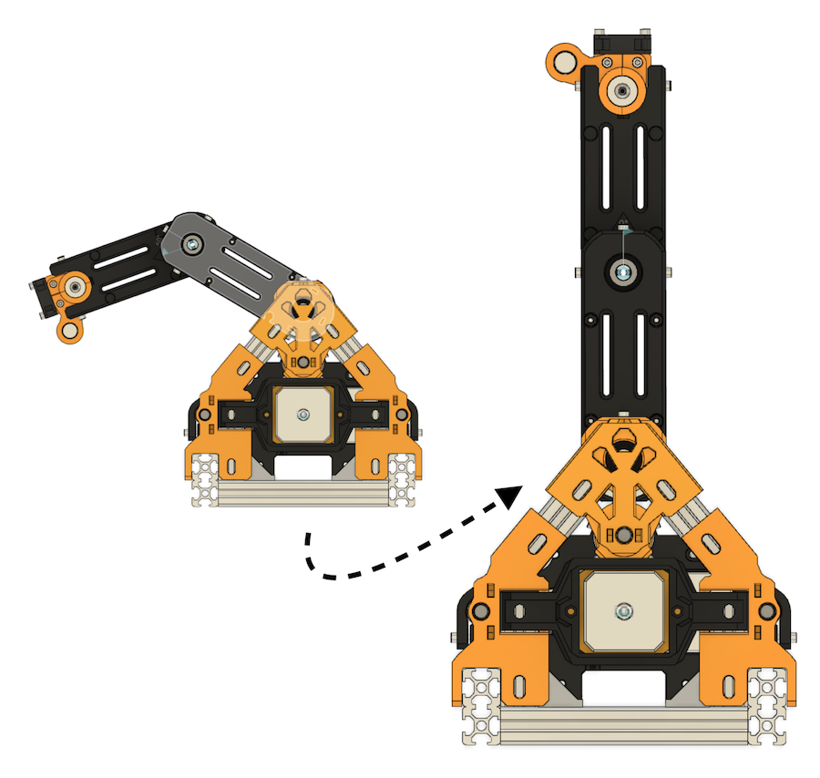
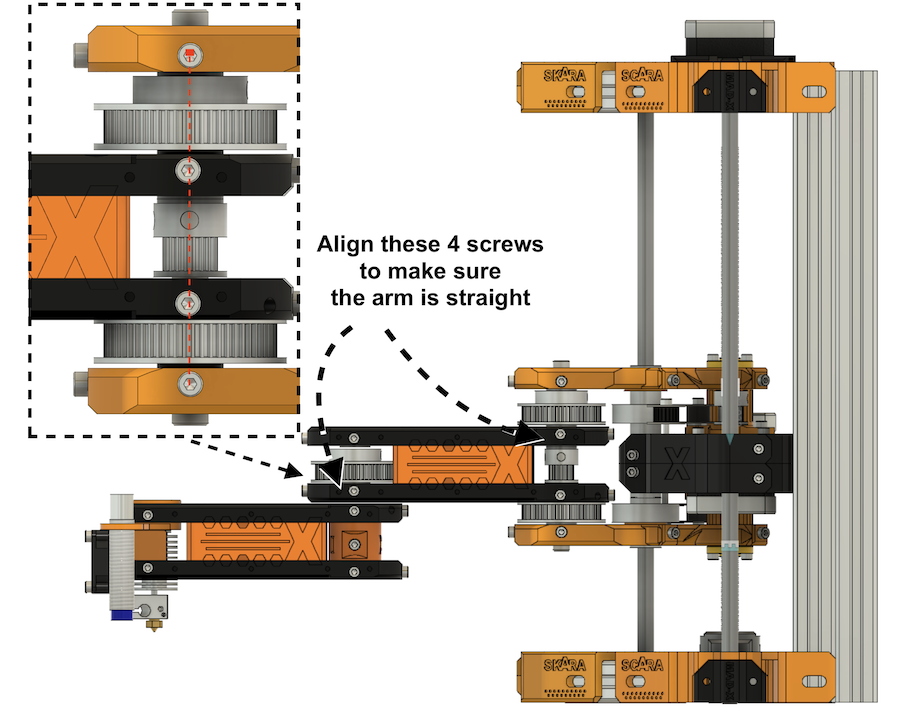
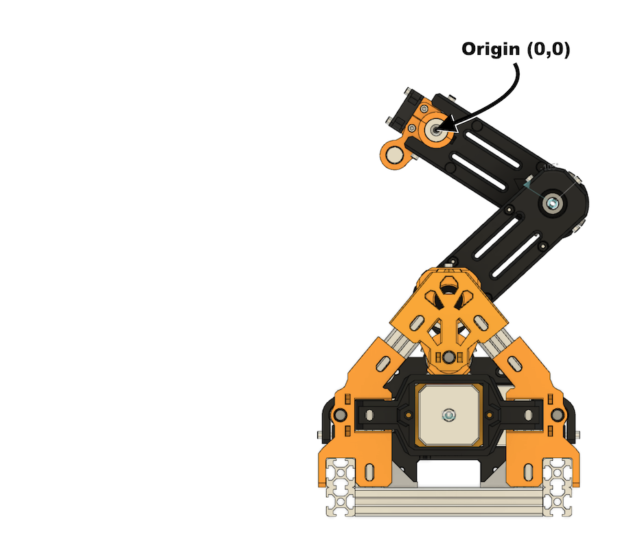

Calibration
===
> Deprecated for Firmware version 0.4. Soon to be updated.


For the current 0.2 alpha version of the firmware, the machine uses no endstops for the X and Y axis, so calibration must be done manually. The code has been modified so the machine can print and home without endstops, so this will work smoothly.

Step 1 - Set the machine in position
---

If the machine is in arbitrary position, disable motors (`M18`) and move it manully in position.



You can use these shoulder and elbow screws for reference, to make sure the arm is straight:


Step 2 - Reset joints angle to 0º
---
Using `M362` set both joints angle to 0º. For more information about `M362` read this [GCodes](firmware/GCODES.md) guide.

```
M362 E0 S0
```

Step 3 - Move to cartesian origin
---
You can now safely move in the cartesian space using `G0` and `G1` commands.

But, before homing, set the machine to its origin. In the default configuration this should coincide with bed center. 

```
G0 X0 Y0
G28
```



Step 4 - Print
---

You can now home the printer and start printing.