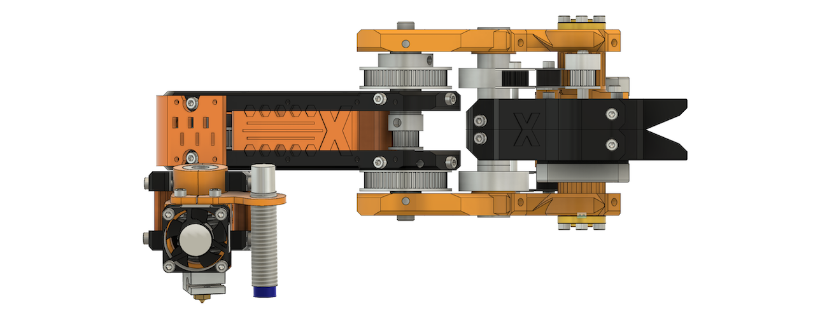
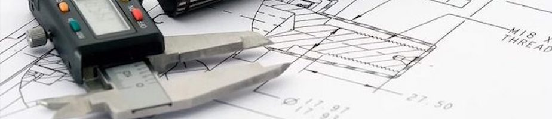

Objective
===
X-SCARA is a project that intends to level-up SCARA design for CNC and 3D printing machines, to the same ease of functionality other mechanical models have, from the classical Cartesian to CoreXY, H-Bot and Delta. If you are interested to know more about the motivation behind this project [this](README_LONG.md).

Hardware
===

The *Hardware* section will contain everything you need to build **X-SCARA**, from the *B.O.M.* listing of all off-the-shelf components you need to buy, to STL files and assembly instructions. Get them from [here](hardware/README.md).

Firmware
===

    X-SCARA has published the first firmware version, and the machine is ready to print!

For firmware build and configuration follow the instructions [here](firmware/README.md).

Calibration procedure
===

Read [here](CALIBRATION.md) more about you can calibrate **X-SCARA** and start printing.

Credits
===
Author and maintainer of this project is *Alex Mircescu*.

X-SCARA parts and assembly were fully designed in *Autodesk Fusion 360*.

