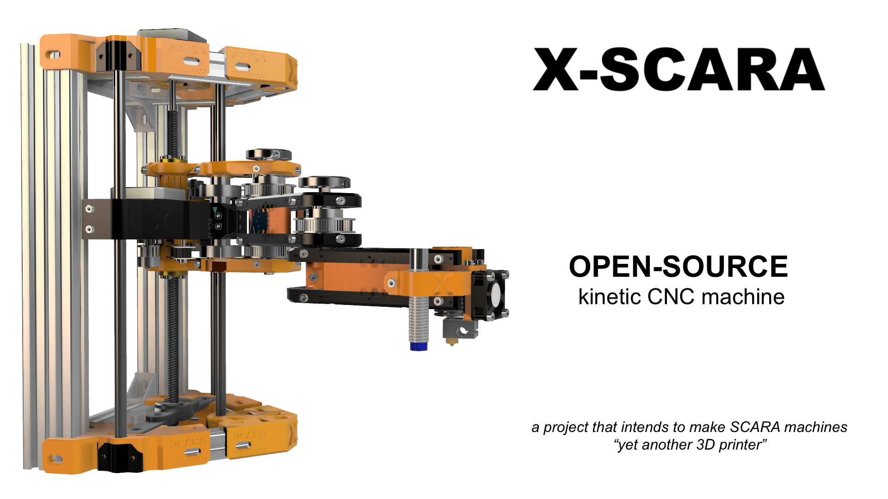

Types of SCARA
===
SCARA mechanical model divides in two slightly different concepts: *serial SCARA* and *parallel SCARA. 

*Parallel SCARA* is a mechanical concept that uses four joints and four segments, two of which are mirrored to compensate for intertia in fast movements.

*Serial SCARA* only uses two segments and two corresponding joints to accomplish the same action. Both parallel and serial SCARA designs uses two rotary actuators (e.g. two motors) to move in the Cartesian space.

History
===
One of the first successful open-source parallel SCARA designs was the [Morgan Scara](https://en.wikipedia.org/wiki/RepRap_Morgan), built by an african engineer in 2013 with the objective to create really affordable printers. 

Since then, only a handfull of counter designs were published in the open-source community, most of them inheriting same design priciples from Morgan's.

For the serial SCARA, most notable is the [MP-Scara](https://www.thingiverse.com/thing:2487048), *MP* standing for *M*ostly *P*rinted.

Motivation
===
For a hardware perspective SCARA is an easy to build 3D printer, but hard to configure and find software support for. The documentation is scarse and the calibration process counter-intuitive even for 3D printing experts.

Delta printers share the same type of mechanical complexity with SCARAs, but they managed to get a respectable place among 3D printers, while the SCARA model is lacking behing circling around the same design principles that made it known.

For this, and not only, this project intends to make a step forward and propose a new mechanical design and prepare a firmware to make it work as simple as a Cartesian.