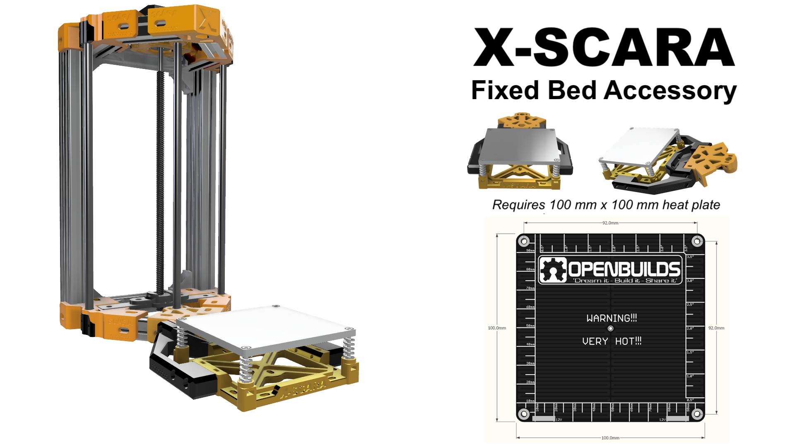
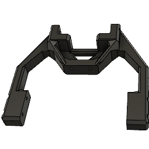
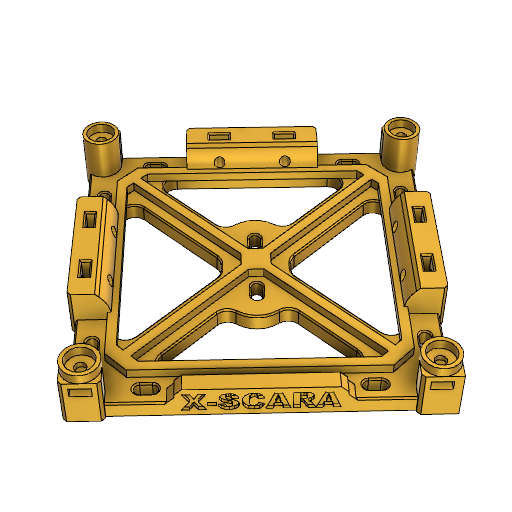
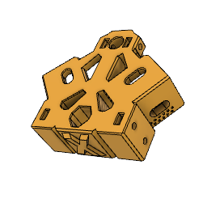
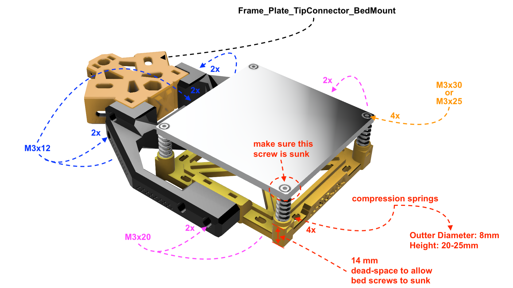

About
===

Every 3D printer has a heated bed, so why shouldn't **X-SCARA** have one too?

This accessory is designed mainly for the *OpenBuilds mini heated bed* heaters (see picture) and it works by connecting the build plate firmly to the **X-SCARA** frame. This rigid connection enables you to do precise bed leveling calibration and to keep it consistent across multiple prints. Needless to say this will avoid ruining your print if you accidentally hit X-SCARA while working.

The *OpenBuilds mini heated bed* can easily reach 100ºC, allowing you to build with materials like *PET, PET-G, TPU*.

Bill of materials
===

Screws and nuts
* 6 x M3x12 screws (or M3x20)
* 4 x M3x20 screws (or M3x30)
* 4 x M3x25 screws (or M3x30)
* 14 x M3 nuts (2.2mm thick)

Electronics
* 1 x NTC 100k B3950 glass or metal thermistor 
* 1 x 100mm x 100mm heated bed (recommended OpenBuilds mini heated bed - check [ooznest.co.uk](https://ooznest.co.uk/product/openbuilds-mini-heated-bed/))

Others
* 4 x bed compression springs (OD 8mm, 20-25mm height)
* aluminum/glass build plate 100 mm x 100 mm

Printed parts
===

| Part                                   | Count | Picture                                                   |
| -------------------------------------- | ----- | :-------------------------------------------------------: |
| Acc_FixedBedMount_Arm                  | 1     |                               |
| Acc_FixedBedMount_HeaterSupport        | 1     |                           |
| Frame_Plate_TipConnector_FixedBedMount</br> (replaces `Frame_Plate_TipConnector`) | 1     |                              |

    Make sure you print the test part to check how your prints fit metal hardware.

Please note that the `Frame_Plate_TipConnector_FixedBedMount` replaces the `Frame_Plate_TipConnector` part from the frame set, to allow `Acc_FixedBedMount_Arm` part to connect to it via 4x **M3x12** screws.

Assembly
===

Step 1 - Assemble the accessory
---


The assembly is pretty much straight forward:

* place all M3 nuts at their designated places in `Acc_FixedBedMount_HeaterSupport` before starting assembly
* connect the heater, the aluminum/glass build plate and the springs to the `Acc_FixedBedMount_HeaterSupport` part and screw in firmly
* connect the `Acc_FixedBedMount_Arm` to the support you just assembled (follow the same instructions you used for building your frame [here](../../frame/README.md))
* connect the modified `Frame_Plate_TipConnector_FixedBedMount` to your frame (replace the old `Frame_Plate_TipConnector` if necessary)
* connect the arm to the new frame part

Step 2 - Firmware configuration
---
Just make sure your scara offset is set to `110` mm in `Configuration.h`:

```C
 #define SCARA_OFFSET_Y    -110    // (mm)
```
For more details check the [configuration guidelines](../../../firmware/CONFIGURE.md).

Alternative mountings
===

In this set you also have a part called `Acc_FixedBedMount_AlternativeArm`. 

This part is an alternative for connecting the `Acc_FixedBedMount_HeaterSupport` to the frame without requiring the replacement of any frame parts. It connects directly to the `Frame_Plate_TipConnector` part and stays secured via two screws that push on the plastic part when fastened.

The downside of this part is that is not as solid as this design and the bed can move up and down if hit.
Check this [video](https://www.instagram.com/p/CK_2IUaI0A7/) to see it in action.

Another alternative will be to screw `Acc_FixedBedMount_HeaterSupport` directly on a fixed surface, using M3 screws. The part provides multiple 3mm drills to allow you to fix it in place on wood or other surfaces.