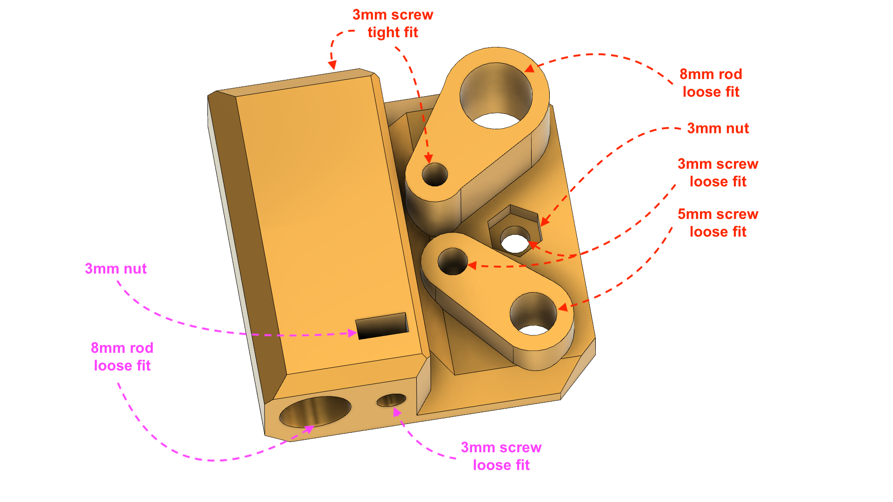
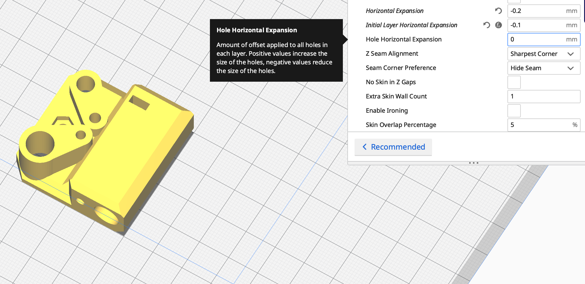

X-SCARA test part
===
Print this test part before printing X-SCARA parts.

Hardware Fit
===

This part is for testing how the printed parts will fit your hardware.

Follow the above instructions to test how this part fits the M8 rod, M3 screws, M3 nuts and M5 screws. Where is marked *loose fit*, you should be able to pull and push the metal part easily into the part. Where is marked *tight fit* you should be able to screw directly into the plastic part. For the nut, it should fit and stay fixed while screwing tightly.

Tunning
===

X-SCARA parts are designed to have a tolerance to fit precise metal parts. Usually that tolerance is around 0.5 mm.

If your 3D printer is already tuned to accomodate that, you may need to change your settings and let the parts handle the tolerance.

Cura
---

If your using Cura, one way to tune your profile to print X-SCARA parts correctly, will be to modify the `Shell`->`Hole Horizontal Expansion` and/or `Shell`->`Horizontal Expansion` setting.

These two settings adjust the offset of the inner and outter polygons of your parts. `Horizontal Expansion` usually deals with plastic contraction, so it is usually set it to a small negative values (e.g. -0.2), while `Hole Horizontal Expansion` is for fixing inner perimeters that are too big or too small. 
