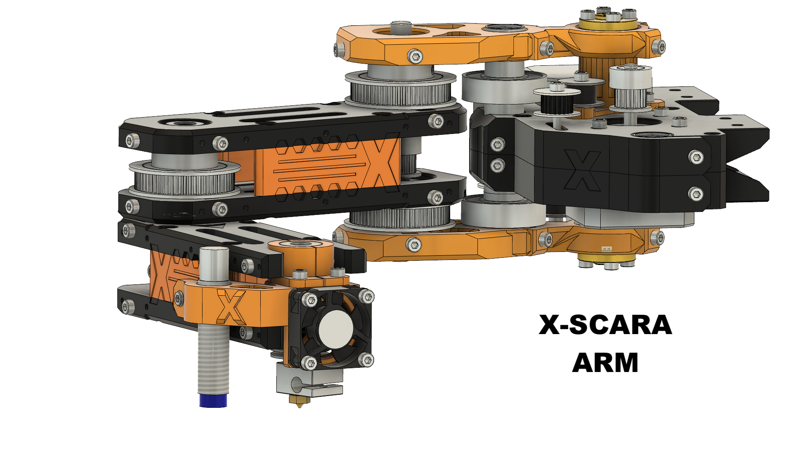

Bill of materials
===

Rods
* 1 x 8 mm rod 80 mm length (or hollow axis)
* 1 x 8 mm rod 40 mm length (or hollow axis)
* 1 x 8 mm rod 60 mm length (or hollow axis)

Linear and radial bearings
* 4 x LM8UU linear bearings 
* 1 x LM8LUU linear bearing
* 6 x 623 radial bearings (OD/ID/T 10x3x4)
* 2 x 6002 radial bearings (OD/ID/T 32x15x9)
* 5 x 608 radial bearings (OD/ID/T 22x8x7)

Pulley and belts
* 2 x 280 mm 2GT closed belt
* 2 x 20 teeth 2GT inner bore 5 mm pulley (motor shaft) 
* 2 x 20 teeth 2GT inner bore 5 mm idler
* 2 x 20 teeth 2GT inner bore 5 mm idler without teeth
* 3 x 60 teeth 2GT inner bore 8 mm

Screws and nuts
* 2 x Tr8 Z-Nut (1 is mandatory, 2 are optional) 
* 70 x M3x10 mm socket head screw
* 20 x M3x12 nnm socket head screw
* 20 x M3x15 or M3x16 mm socket head screw
* 10 x M3x20 mm socket head screw
* 10 x M3x30 mm socket head screw
* 100 x M3 nuts (2mm thick)

Motors
* 2 x NEMA 17 motor 

CAD
===
For a complete preview of the the assemblies, visit these links:
* [Complete arm assembly](https://a360.co/2YkuguU)
* [Base arm assembly](https://a360.co/3c0eRo9)
* [Shoulder assembly](https://a360.co/3dAIDj8)
* [Elbow assembly](https://a360.co/2B50gKS)

Printed parts
===

| Part                         | Count | Picture                                                             |
| ---------------------------- | ----- | :-----------------------------------------------------------------: |
| **BASE**                     |       |                                                                     |
| Arm_Base_MotorPlate          <td> 2<td rowspan=2> 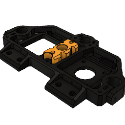           |
| Arm_Base_ZPlate_Mid_NutHolder| 1     |                                                                     |
| Arm_Base_ZHub_Top            <td> 1  <td rowspan=2> 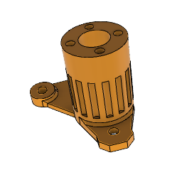                |
| Arm_Base_ZHub_Bottom         | 1     |                                                                     |
| **SHOULDER**                 |       |                                                                     |
| Arm_Shoulder_Plate_Top       <td> 1<td rowspan=5> 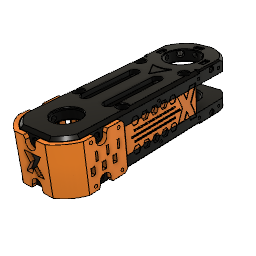                    |
| Arm_Shoulder_Plate_Bottom    | 1     |                                                                     |
| Arm_SideWall_Left            | 1     |                                                                     |
| Arm_SideWall_Right           | 1     |                                                                     |
| Arm_Plates_Cover             | 1     |                                                                     |
| Arm_Shoulder_Connector       | 1     |                |
| **ELBOW**                    |       |                                                                     |
| Arm_Elbow_Plate_Top          <td> 1<td rowspan=5> 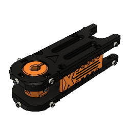                       |
| Arm_Elbow_Plate_Bottom       | 1     |                                                                     |
| Arm_Elbow_RodHub             | 1     |                                                                     |
| Arm_SideWall_Left            | 1     |                                                                     |
| Arm_SideWall_Right           | 1     |                                                                     |
| **E3D MOUNT**                |       |                                                                     |
| Arm_EMount_Base_ABL          <td> 1<td rowspan=3> 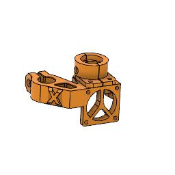                      |
| Arm_EMount_Base_Left         | 1     |                                                                     |
| Arm_EMount_Base_Right        | 1     |                                                                     |

Assembly
===
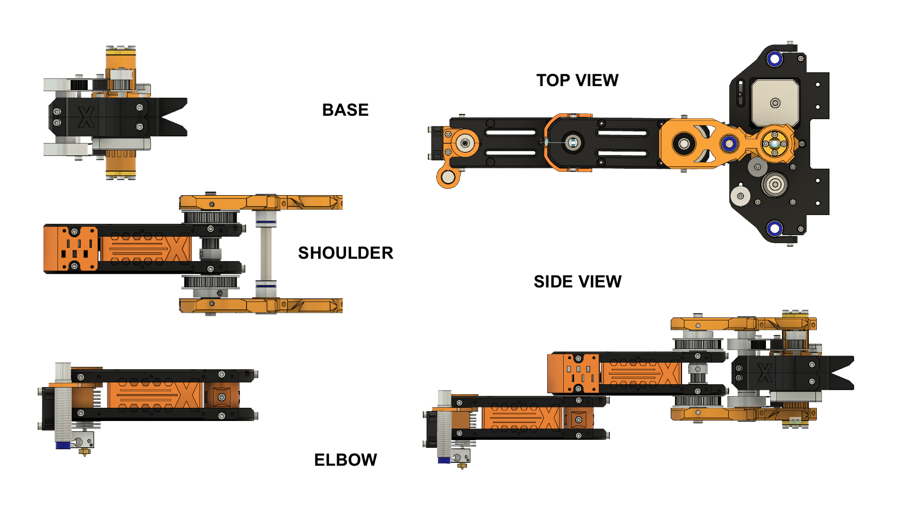 

The arm assembly can be split into five separate stages: 

1. Base assembly
2. Shoulder assembly
3. Elbow and extruder mount assembly
4. Connecting shoulder and base
5. Connecting the arm to X-SCARA frame 

These parts will then connect together and form the entire arm. The arm can later on be coupled to the X-SCARA frame.
You can fully assemble the arm and test it, separately from the frame.

Stage 1 - Arm Base
===
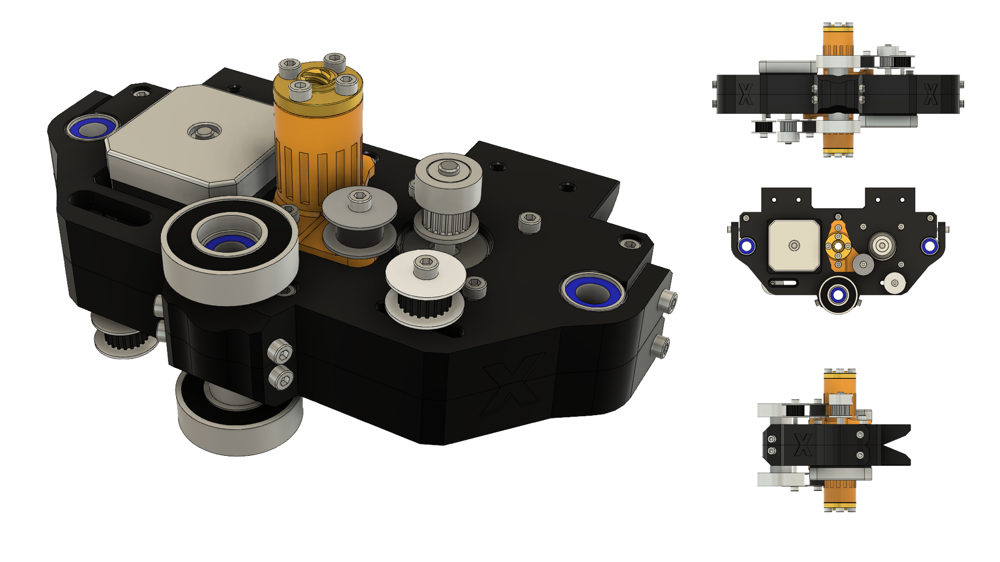 

## For a full preview of this assembly go [here](https://a360.co/3c0eRo9).

Step 1 - Join the two Z-Plates
---
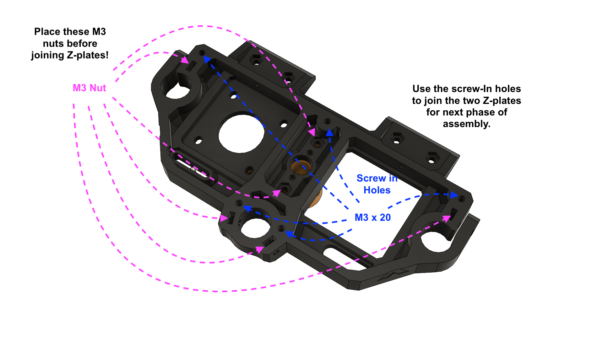

The *Arm_Base_MotorPlate* must be printed twice. They are designed to be complentary, so one can be placed on top of the other.
Before doing so, place the following M3 nuts first and also place *Arm_Base_ZPlate_Mid_NutHolder* inside the Z-Plate to heep the nuts from falling.

Step 2 - Attach linear bearings, NEMA motors and Z-hub
---
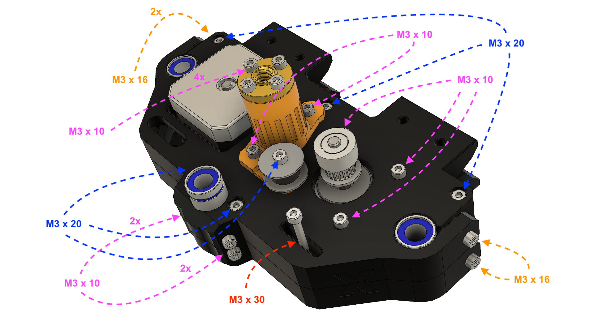

Above is the screw map of the assembly, it will guide you throughout this step.
Attach the parts to the z-plates, in this prefered order:

1. Tighten the **M3x20** screws for the screw-in holes mentioned in **Step 1**

This will join the two Z-plates together. 
If the screws tend to fall out from the screw-in holes, use some Thread Lock Glue to hold them in place. 
The part's structural resistance doesn't rely on those, don't worry. 

2. Attach the **NEMA17** motors with three **M3x10** screws, leaving the fourth one free
3. Attach the Z-hubs with two screws for each
4. Place *only one* trapezoidal Z-nut on one Z-hub and screw it down

The second Z-nut is optional, you can use it to eliminate backlash, but it must be tighten after the base is mounted on the lead screws.
Otherwise, if the Z-Nuts are not properly aligned with the lead screw pitch, it may lock itself on the Z screw.

5. insert the **LM8UU** and **LM8LUU** bearings and secure them with the corresponding screws

After this, the part should feel like one solid piece. The metal linear bearings should properly join both Z-plates.

6. Attach the center idler pulley and secure it down with a **M3x20** screw (place washers!)

Place one or more washers between the idlers and the Z-hub. 

7. Attach the drive pulley to the motor shaft 

Step 3 - Install adjustable pulley
---
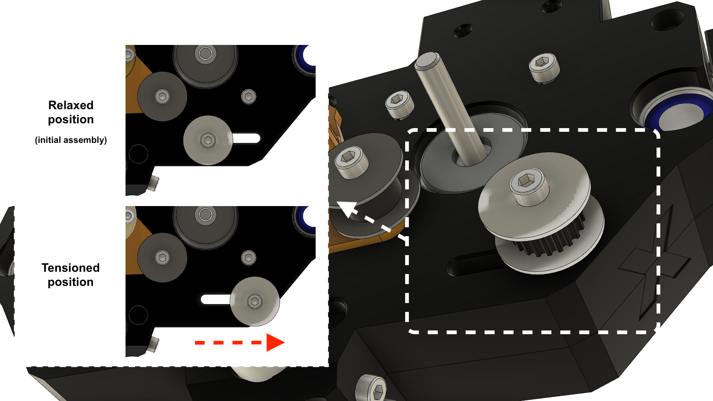

1. Place the pulley on **M3x30** screw and add washers to align it with the motor pulley
2. Place the screw in *relaxed* position
3. insert an M3 nut using the opening on the other side of the Z-plate and tighten it gently 

This may seem a bit difficult at first. Use a pair of tweezers to help you out with placing the M3 nut.

The installation of the pulley will be finalized when the belt is installed.

Step 4 - Attach the 6002 bearing and align belt components
---

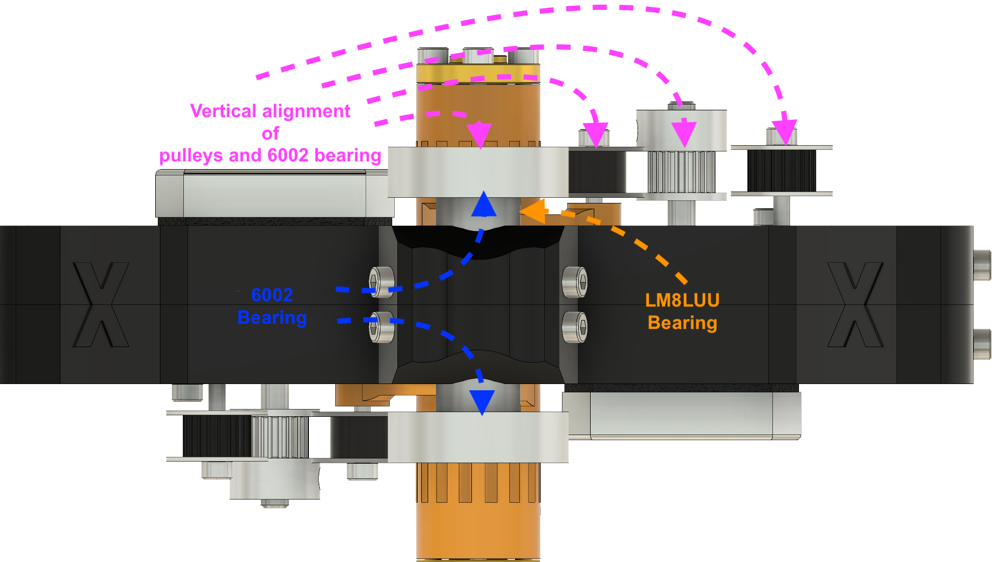
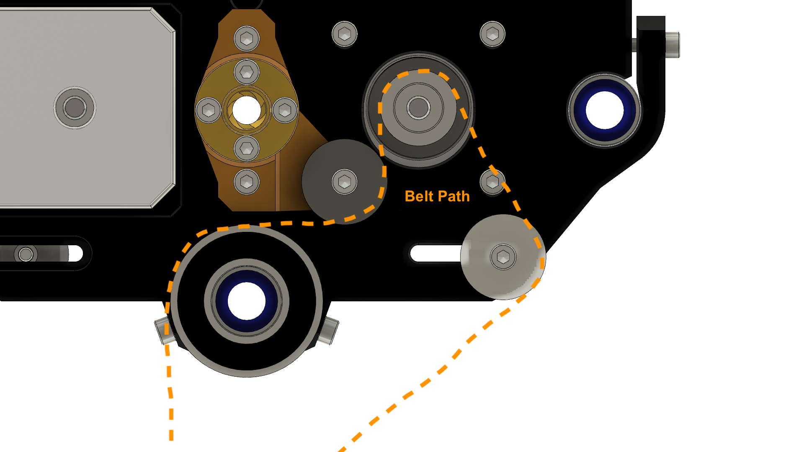

Stage 2 - Shoulder component
===
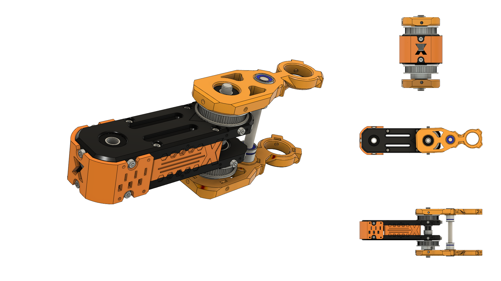

## For a full preview of this assembly go [here](https://a360.co/3dAIDj8).

Step 1 - Install 3 x 608 bearings and the drive pulley
---
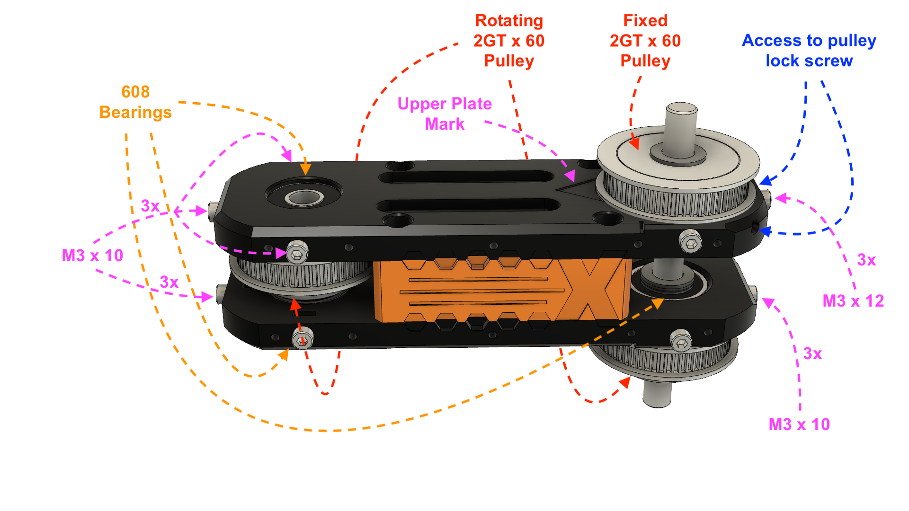

Each 608 bearing is connected to the arm plate using three **M3x10** screws. 
Tighthen the screws for each bearing in the same order, to avoid missalignment. 

Step 2 - Install the two 2GT x 60 drive pulleys
---
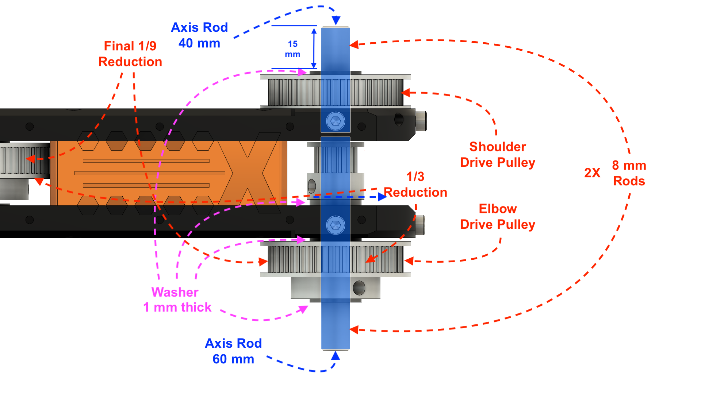

Connect the top **2GT x 60** **shoudler drive pulley** first, with the 8mm rod inserted and attach it to top arm's plate in the same way you connected the 608 bearings. If you need to adjust the rod's height afterwards, you can use the two openings on the back of top plate to access the dowel pins of the pulley and losen the screws. 

Make sure you align the pulley first to get to be able to reach those:
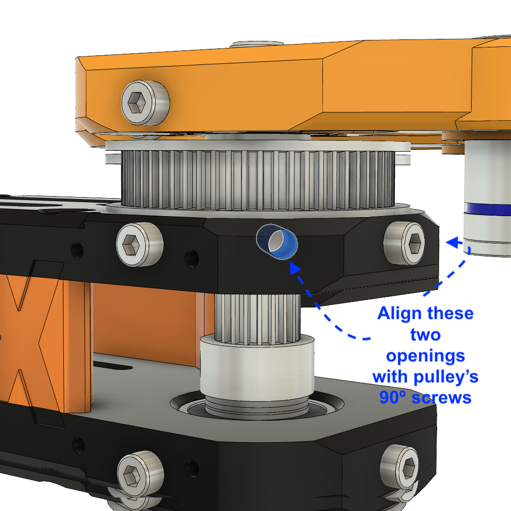

For the bottom **2GT x 60** **elbow drive pulley**, first insert the 60 mm rod and tighten it. Pass the rod through the 608 bearing on the bottom plate, with a washer between the bearing and pulley. Add two (or more) washers on top of the axis and them insert the **2GT x 20** pulley. 

Press the **2GT x 20** pulley agains the **2GT x 60** pulley to create a firm grip of the bottom plate, then secure it by screwing the dowel pins on the **2GT x 20** pulley.

Step 3 - Install tensioning bearings
---
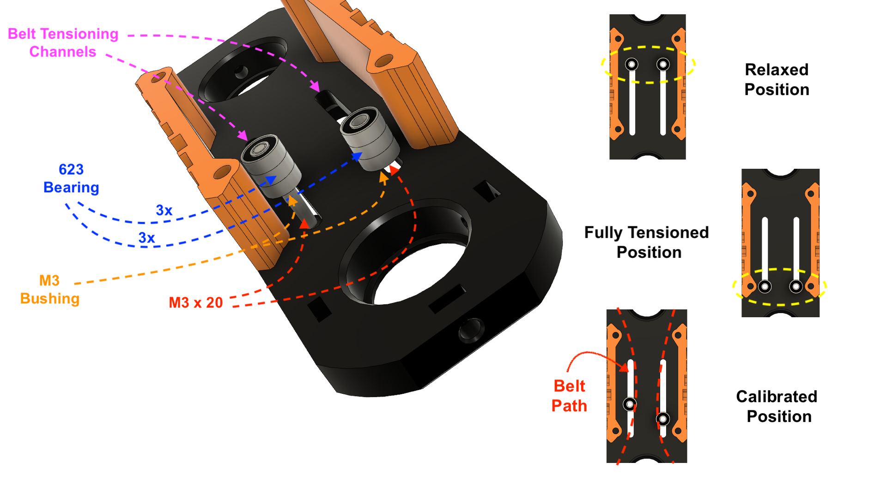

Use 2 sets of 3 x **623 bearings** each and one *M3x20* screw as axis, to install them as tensioning idlers. 
Place the screw with the head facing down (towards the bottom plate) and the M3 nut on top of the last bearing.

Place the two tensioning idlers in the relaxed position, as seen above.

Step 4 - Elbow axis
---
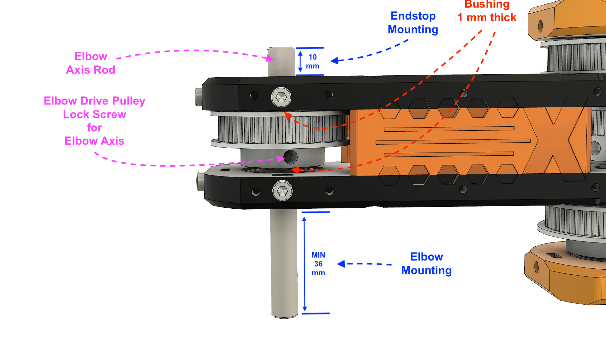

Insert the elbow rod to the **2GTx60** pulley and connect it to the bottom plate, by inserting it to the front **608** bearing.

Step 5 - Place the belt
---

Place the belt between the back **2GT x 20** pulley and the front **2GT x 60** **elbow drive pulley**. Make sure the pulleys are aligned. If not, add or remove washers to raise or lower the **2GT x 20** on the back.

Adjust the tensioning idlers, just to hold the belt in place. Don't fully tension the belt yet.

Step 6 - Connect the two shoulder plates
---
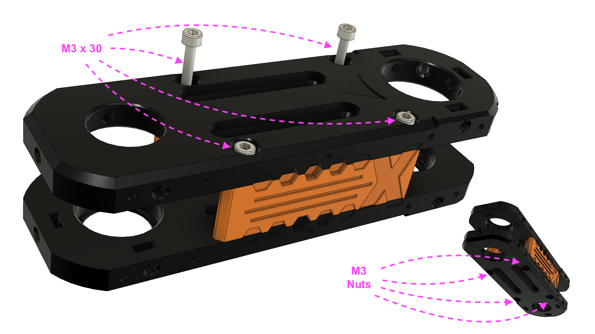

Connect the bottom plate and the top plate via the four **M3x30** that will pass through **Arm_SideWall_Left** and **Arm_SideWall_Right**. 

Install only two out of the four **M3x30** screws so the side walls can pivot and give you access to tensioning idlers.

Step 7 - Tension the belt
---
Tension the idlers and secure the screws so the idlers are firmly set in position.

The front axis should not present any noticeable backlash after tighning, but in the same time, the elbow drive pulley should be moveable by hand with ease. 

Step 8 - Prepare the shoulder connector
---
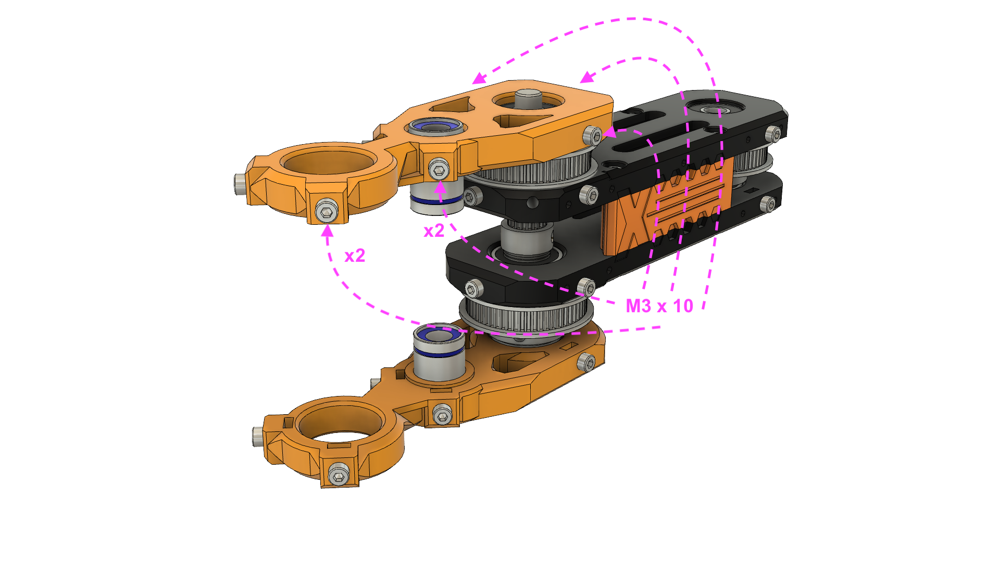

The **Arm_Shoulder_Connector** wil connect the plates to the Arm base. Prepare it by mounting the two **608** radial bearings the same way you did with the shoulder plates. 

Attach the two **LM8UU** linear bearings to the connector and secure them with 2 x **M3x10** screws for each. 

Also, attach the **M3x10** screws on the back-side of the connector, but don't tighten yet. 
These will be used to attach the shoudler to the hub component of the base.

Step 9 - Close arm's side walls
---
Add the two remaining **M3x30** screws to finalize the shoulder assembly. 
Tighten all four side wall screws.

Step 10 - Install cover  (optional)
---
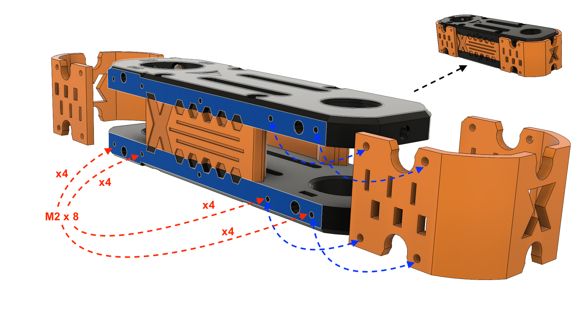

Cover can be installed on the front of the shoulder arm, and as well on the back.

Stage 3 - Elbow
===
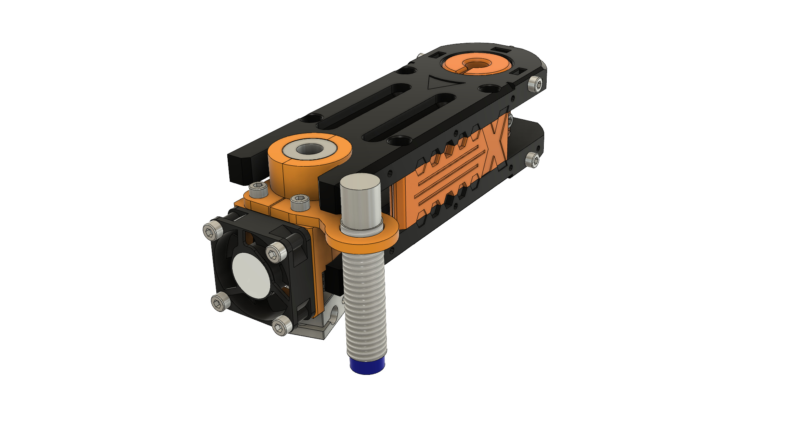

## For a full preview of this assembly go [here](https://a360.co/2B50gKS).

The hard part is gone. Now we need to assemble the elbow and the extruder mount. This is how it must look when finished.

Step 1 - Connect elbow plates
---

Connect bottom and top elbow plates using four **M3x30** screws, just like on the shoulder plates. Pass the screws through **Arm_SideWall_Left** and **Arm_SideWall_Right** parts.

Step 2 - Connect elbow's hub to shoulder's front axis
---
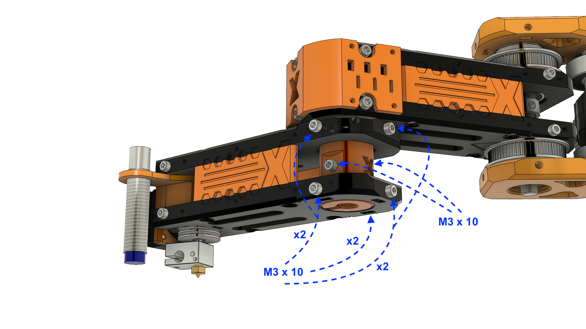

Place a washer between the hub and the **608** bearing in the bottom shoulder plate. Connect the hub to the 8mm rod and tighten the side **M3x10** screws.

Step 3 - Connect the assembled plates to rod hub
---
Insert and tighten the six **M3x10** screws to firmly connect the elbow plates to the shoulder.

Step 4 - Assemble the extruder mount
---
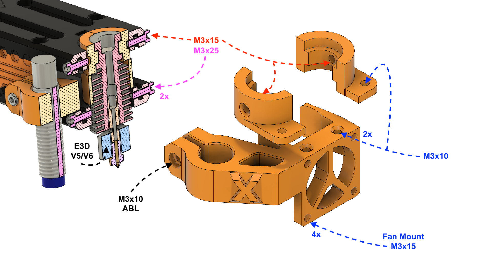

It can be assembled separately. Get your *E3D* hotend and plece it between the two **Arm_EMount_Base** parts. Connect the parts together by mounting the **Arm_EMount_Base_ABL** part. Screw directly in plastic, no metal nuts are required.

Step 5 - Install the extruder mount
---

Two **M3x15** can be used to connect the extruder mount to the top elbow plate. 

To ensure the hotend doens't pivot around these two while printing, two additional **M3x25** screws can be mounted on the bottom, to get a firm grip directly on the **E3D**'s radiator.

Stage 4 - Attach shoulder to arm base hub
===
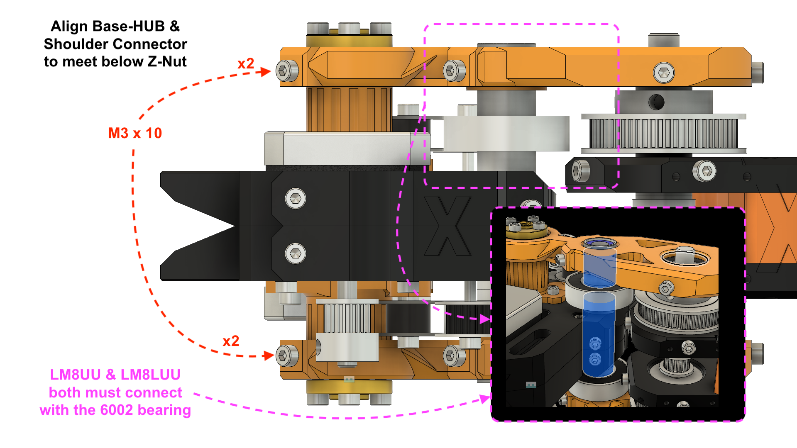

Take the previosly assembled **Arm_Shoulder_Connector** part and connect the base of the arm with the
shoulder assembly. Connect the base hub with the shoulder connector and the later one with the shoulder back axis.

Tighten the four screws on the back of the **Arm_Shoulder_Connector** as indicated. Now the entire arm should be one working piece. 

Stage 5 - Atach the entire arm to the frame
===

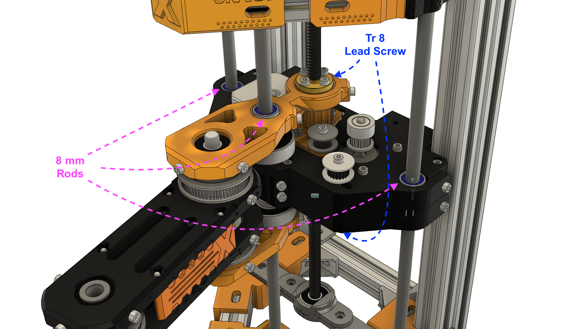

* Remove all rods and the the lead screw from your frame. Place the frame on the back side for ease of manoeuvre.
* Install the side 8mm rods partially and insert the rods through the arm assembly. 
* Insert the two rods all the way and secure them with the clamps
* Insert the third rod and secure it

Test if the arm glides smoothly and if not, make adjustments on the frame for proper alignment of the rods.

* Insert the lead screw from the bottom side of the frame
* Screw it through the arm's Z-nut

If you are using two Z-nuts make sure the arm can climb and descend easily. 
Adjust the screws on one of the Z-nuts to make sure it does not add too much tension on the lead screw.

* Connect the lead screw to the Z motor with the coupling shaft

Done
===
Nicely done. Now assemble the [frame](../frame/README.md) if you haven't done so by now.
