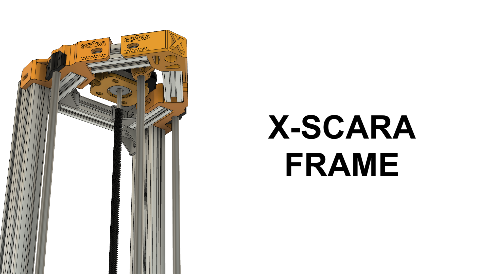
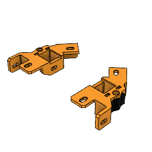
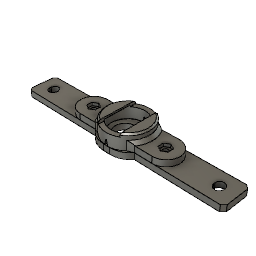
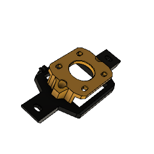
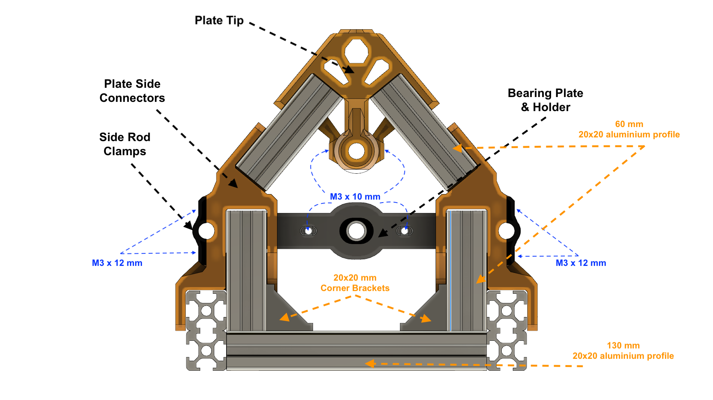
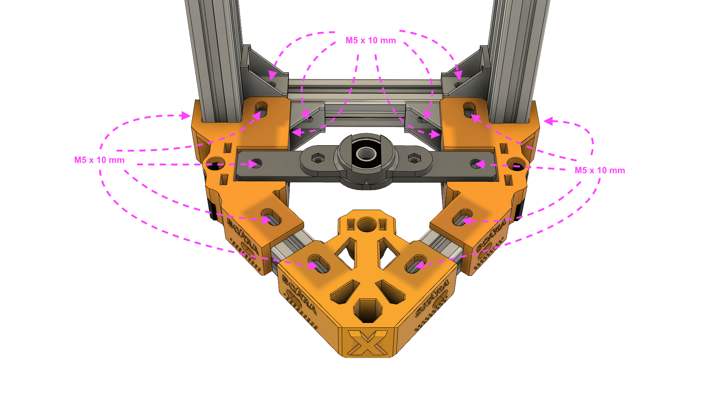
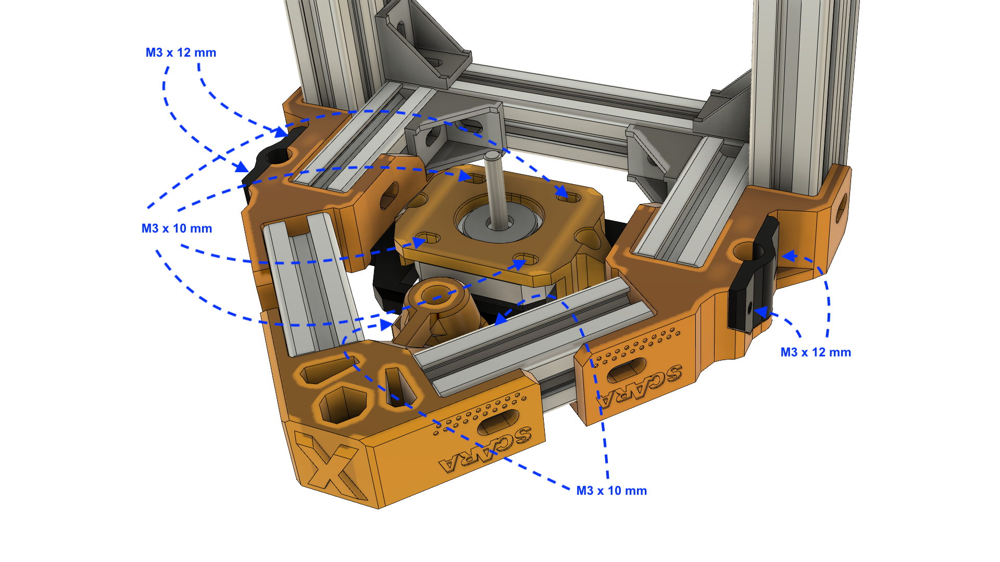
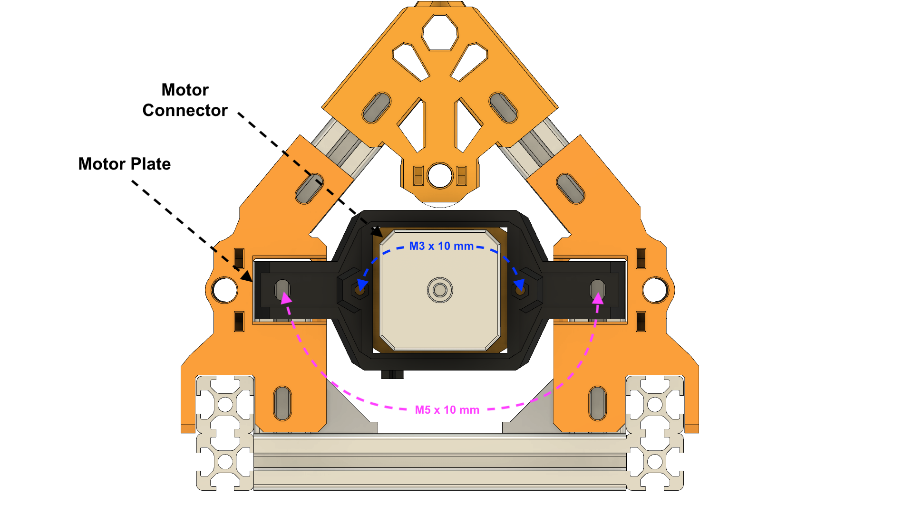
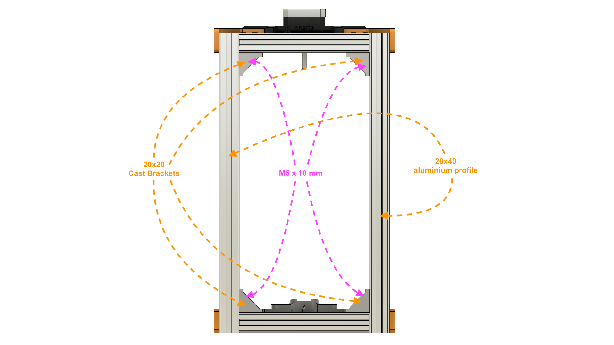
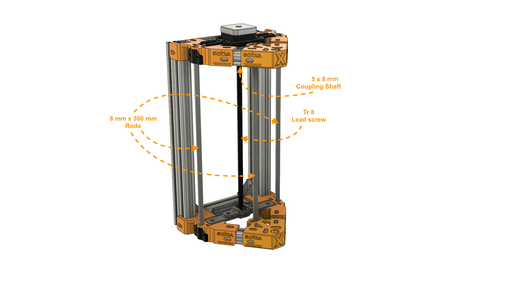

Bill of materials
===

Each element marked with (Z) can be extended by a given offset if you intend to make the SCARA higher than originally designed.

Aluminum extrusions
* 2 x 20x40 300mm aluminum profile (Z)
* 2 x 20x20 130mm aluminum profile
* 8 x 20x20 60mm aluminum profile 

Brackets
* 8 x 20x20 Corner Cast bracket 

Rods and lead screw
* 3 x 8mm 300mm rods (Z)
* 1 x Tr8/x 250 mm lead screw (Z) (2 mm pitch preferred)

Screws and nuts

* 50 x Button Head M5 x 10mm Screws
* 50 x M5 Drop In Hammer T-Nuts for 2020 (OR 50 x M5 square Nuts for 2020)
* 15 x socket Head Screw M3x10
* 10 x socket Head Screw M3x12
* 20 x M3 nuts (2 mm thick)
* 2 x T-Nuts (corresponding to your chosen lead screw) 

Others
* 1 x 608 bearing (OD/ID/T 22x8x7)
* 1 x NEMA 17 motor 
* 1 x Flexible Shaft Coupling 8x5 mm

CAD
===
For a complete preview of the frame model check this Autodesk Fusion 360 [shared link](https://a360.co/2UZK4Bm).

Printed parts
===

| Part                         | Count | Picture                                                             |
| ---------------------------- | ----- | :-----------------------------------------------------------------: |
| Frame_Plate_TipConnector     | 2     |                    |
| Frame_Plate_Side_Left        <td> 2  <td rowspan=3>    |
| Frame_Plate_Side_Right_      | 2     |
| Frame_Plate_Side_RodClamp    | 4     |
| Frame_Z_BearingPlate         <td> 1  <td rowspan=2>             |
| Frame_Z_BearingHolder        | 1     |
| Frame_Z_MotorPlate           <td> 1  <td rowspan=2>                 |
| Frame_Z_MotorConnector       | 1     |

Assembly
===

Step 1 - Assemble the bottom plate
---

Make sure when you connect these parts that the aluminum profiles have a corect 90º angle, before tightening the screws.

Don't tighten the screws too hard to allow adjustments at the end of the assembly. 
This is especially valid for the Z bearing plate, which requires adjustment of the Z lead screw after the arm
is installed.

Step 2 - Assemble top plate
---

The top plate is very much similar with the bottom plate, with the exception of the Z-Motor mount. 

Don't tighten the screws too hard for the motor mount. 
Like the bearing plate, it will require adjustments after arm installation.

Step 3 - Assemble the plates on the back frame
---

This is somewhat straight-forward. Make sure the plates are parallel after assembly.

Step 4 - Assemble the rods and lead screw (temporarly)
---

This parts will get their final assembly after the arm is fully assembled and installed. 
Place them just to check for missalignments.

Done
===
Nicely done. Now assemble the [arm](../arm/README.md) if you haven't done so by now.
